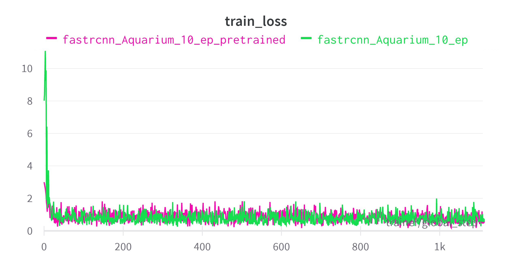
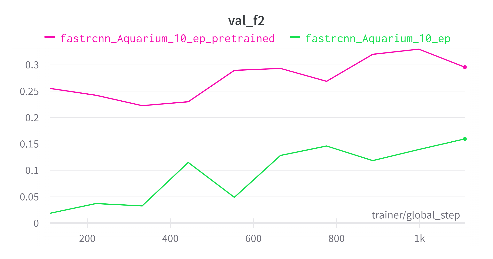
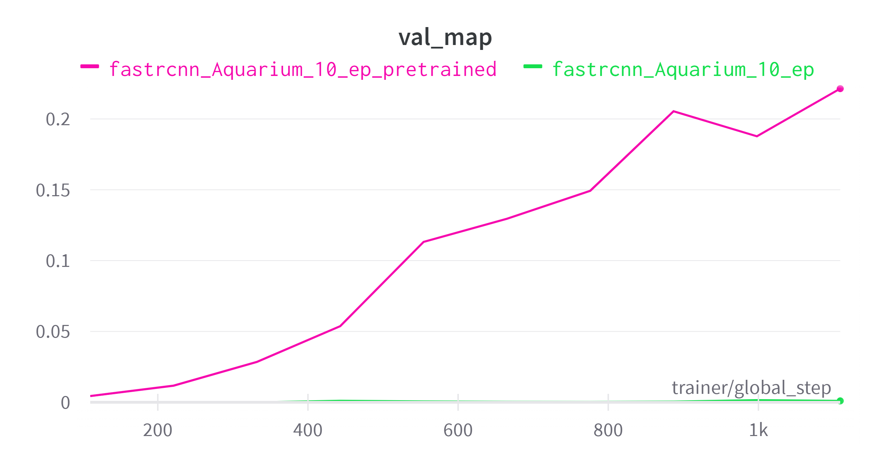
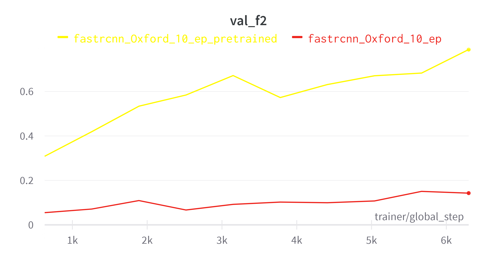
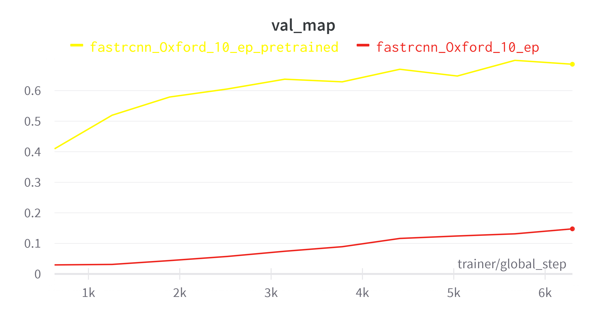

# Stage I: Model training via Pytorch Lightning & Wandb

## Artifacts 
All received artifacts (state dictionary, .mar, wandb logs, pl checkpoints) are available here:
[artifacts](https://drive.google.com/drive/folders/1p7jC-KzWGNxQYGj-o9_Ecdu4ShsI63fi?usp=sharing)
## MS COCO Datasets

The dataset structure should look like this::

    ├── train                    # required
    │   ├── _annotations.coco.json          
    │   ├── image1.jpg         
    │   └── ...   
    ├── valid                    # required               
    │   ├── _annotations.coco.json          
    │   ├── image1.jpg         
    │   └── ...                
    ├── test                    # opt               
    │   ├── _annotations.coco.json          
    │   ├── image1.jpg         
    │   └── ...  

Datasets can be converted to MS COCO format using Roboflow or download ready-made datasets in the required format: 
[Roboflow Public Datasets](https://public.roboflow.com/)  

I chose two small datasets: [Oxford Pets](https://public.roboflow.com/object-detection/oxford-pets) and
[Aquarium](https://public.roboflow.com/object-detection/aquarium)

**Interpreter: conda python 3.10** 

Dependencies: [requirements.txt](./requirements.txt). 

```bash
pip install -r requirements.txt
```

_**Please use these dependencies - not from the wandb logs, as the training cycle will take place on kaggle 
(even one epoch on such small datasets will take ten hours on my laptop). 
Artifacts / logs and checkpoints included in the project were received on kaggle, also u can see model training baseline
in kaggle here: [baseline.ipynb](./model_train/baseline.ipynb).**_

In Pytorch Lightning for training we need to describe LightningModule class and LightningDataModule class which are 
represented at [COCO_Module.py](./model_train/COCO_Module.py) and [COCO_DataModule.py](./model_train/COCO_DataModule.py)

To configure learning parameters, use [config.yaml](./model_train/config.yaml) where you can set the following options:
```yaml
dataset_path: "./path_to/dataset"
batch_size: 4
epoch_num: 1

checkpoint_pl: ""

wandb_project_name: "ai_cloud_demo"
wandb_run_name: "model_name_n_ep_params"

fast_dev_run: False

checkpoint_pl_output: "./path_to/checkpoints_pl/"
model_state_dict_output: "./path_to/state_dicts/"

gpus_num: 0
```
AAfter completing the configuration, you can start training (in the model_train dir):
```bash
wandb login
python trainer.py
```
## Metrics
For validating my multi-class object detection model on MS COCO dataset I choose F2 and mAP metrics because
F2 and mAP (mean Average Precision) are widely used evaluation metrics in the field of computer vision for
multi-class object detection tasks. The F2 score takes into account both precision and recall, and it gives
a higher weight to recall than precision. This makes it suitable for evaluating models in scenarios where detecting
as many objects as possible is more important than having a high precision. 
On the other hand, mAP provides a more comprehensive evaluation of the model's overall performance by computing the
average precision over all classes. By using both F2 and mAP metrics, you can get a balanced assessment of your model's
performance in terms of both object detection accuracy and overall quality.  

Interpretation of F2 metric: [F2.py](./model_train/F2.py)

## Wandb

### Aquarium Dataset

#### Comparing of two runs on Aquarium dataset: FRCNN vs FRCNN pretrained on 10 epochs:  
 




#### Comparing of two runs on Oxford dataset: FRCNN vs FRCNN pretrained on 10 epochs:  





# Stage II: Model serving
At first, we need to pull torchserve image:
```bash
docker pull pytorch/torchserve:latest
```

Installing torch-model-arciver (into the serve_demo dir):
```bash
git clone https://github.com/pytorch/serve.git
cd serve/model-archiver
pip install .
```
After training the model we get the object detection model's state_dict
```
(ai_cloud) deusenko@deusenko:~/Downloads/ezyZip/ai_cloud/serve_demo/state-dicts$ ls
fastrcnn_Oxford_10_ep_pretrained_model.pth
```
For creation a model archive file and serve the model in TorchServe we must define model class which is defined at [model.py](serve_demo/model.py) file:
```python
from torchvision.models.detection.faster_rcnn import FasterRCNN
from torchvision.models.detection.backbone_utils import resnet_fpn_backbone


class FRCNNObjectDetector(FasterRCNN):
    def __init__(self, num_classes=3, **kwargs):
        backbone = resnet_fpn_backbone('resnet50', True)
        super(FRCNNObjectDetector, self).__init__(backbone, num_classes, **kwargs)
```
In next must be declared the Handler class which is defined as [object_detector.py](serve_demo/object_detector.py) (see full code here). Handlers are the ones responsible to make a prediction using your model from one or more HTTP requests.
```python
import torch
from torchvision import transforms
from torchvision import __version__ as torchvision_version
from packaging import version
from ts.torch_handler.vision_handler import VisionHandler
from ts.utils.util import map_class_to_label


class ObjectDetector(VisionHandler):

    image_processing = transforms.Compose([transforms.ToTensor()])
    threshold = 0.5

    def initialize(self, context):
        ...

    def postprocess(self, data):
        ...
```
In Handler class we will map class label to index's that we will get from model prediction for that purpose we must create [index_to_name.json](serve_demo/index_to_name.json) file:
```json
{
  "0": "__background__",
  "1": "cat",
  "2": "dog"
}
```

Getting torchserve docker image:
```
(ai_cloud) deusenko@deusenko:~/Downloads/ezyZip/ai_cloud/serve_demo$ docker pull pytorch/torchserve:latest
```
Now we are ready to create a model archive file:

```

(ai_cloud) deusenko@deusenko:~/Downloads/ezyZip/ai_cloud/serve_demo$ torch-model-archiver --model-name fastrcnn_oxford_10p \
--version 1.0 \
--model-file ./model.py \
--serialized-file ./state-dicts/fastrcnn_Oxford_10_ep_pretrained_model.pth \
--handler object_detector \
--extra-files index_to_name.json
(ai_cloud) deusenko@deusenko:~/Downloads/ezyZip/ai_cloud/serve_demo$ mkdir model-store
(ai_cloud) deusenko@deusenko:~/Downloads/ezyZip/ai_cloud/serve_demo$ mv fastrcnn_oxford_10p.mar model-store/
```
Now we can run the torchserve docker container with all the required parameters:
```
(ai_cloud) deusenko@deusenko:~/Downloads/ezyZip/ai_cloud/serve_demo$docker run --rm -it \
-p 4000:8080 \
-v $(pwd)/model-store:/home/model-server/model-store pytorch/torchserve:latest \
torchserve --start --model-store model-store --models fastrcnn_oxford_10p=fastrcnn_oxford_10p.mar
```

After all loadings we can send a POST request:
```
(ai_cloud) deusenko@deusenko:~/Downloads/ezyZip/ai_cloud/serve_demo$ curl -X POST http://127.0.0.1:4000/predictions/fastrcnn_oxford_10p -T inputs/dog.jpg
```

Response:
```
[
  {
    "dog": [
      242.1878662109375,
      79.82120513916016,
      553.845458984375,
      403.3809814453125
    ],
    "score": 0.924798309803009
  }
]
```

And now example with model trained on aquarium dataset:

```json
{
  "0": "__background__",
  "1": "fish",
  "2": "jellyfish",
  "3": "penguin" ,
  "4": "puffin",
  "5": "shark",
  "6": "starfish",
  "7": "starfish"
}
```

```
(ai_cloud) deusenko@deusenko:~/Downloads/ezyZip/ai_cloud/serve_demo$ torch-model-archiver \
--model-name fastrcnn_Aquarium_10p\
 --version 1.0 \
 --model-file ./model.py \
 --serialized-file ./state-dicts/fastrcnn_Aquarium_10_ep_pretrained_model.pth \
 --handler object_detector \
 --extra-files index_to_name.json
(ai_cloud) deusenko@deusenko:~/Downloads/ezyZip/ai_cloud/serve_demo$ mv fastrcnn_Aquarium_10p.mar model-store/
(ai_cloud) deusenko@deusenko:~/Downloads/ezyZip/ai_cloud/serve_demo$ docker run --rm -it -p 4000:8080 \
 -v $(pwd)/model-store:/home/model-server/model-store pytorch/torchserve:latest torchserve \
 --start --model-store model-store --models fastrcnn_Aquarium_10p=fastrcnn_Aquarium_10p.mar
```
Sending a request: 
```
(ai_cloud) deusenko@deusenko:~/Downloads/ezyZip/ai_cloud/serve_demo$ curl -X POST http://127.0.0.1:4000/predictions/fastrcnn_Aquarium_10p -T inputs/fish.jpg
```

Response:
```
[
  {
    "fish": [
      101.84014129638672,
      250.2340545654297,
      247.8326873779297,
      305.7769775390625
    ],
    "score": 0.6381789445877075
  },
  {
    "fish": [
      249.14352416992188,
      711.0995483398438,
      433.8061218261719,
      780.928955078125
    ],
    "score": 0.5510987043380737
  },
  {
    "fish": [
      6.640902042388916,
      925.1405029296875,
      70.9964599609375,
      993.0150146484375
    ],
    "score": 0.5437356233596802
  },
  {
    "fish": [
      53.625152587890625,
      659.5548706054688,
      225.3121795654297,
      733.9536743164062
    ],
    "score": 0.5347429513931274
  },
  {
    "fish": [
      223.99856567382812,
      635.2684326171875,
      382.63006591796875,
      686.63330078125
    ],
    "score": 0.5149894952774048
  },
  {
    "fish": [
      480.7139587402344,
      661.141357421875,
      665.9738159179688,
      744.1452026367188
    ],
    "score": 0.5109662413597107
  }
```
